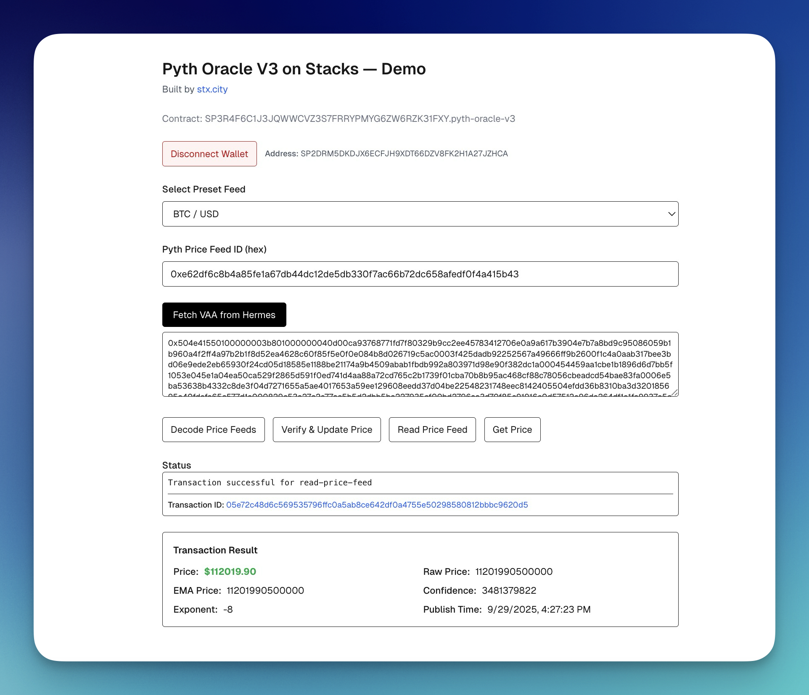

# Pyth Oracle V3 on Stacks — Demo

A demonstration application for interacting with the Pyth Oracle V3 smart contract on the Stacks blockchain. Built by [stx.city](https://stx.city).

## Overview

This application provides a user-friendly interface to interact with Pyth Network price feeds on Stacks. It demonstrates how to fetch, decode, verify, and read price data from the Pyth oracle contract.

**Contract Address:** `SP3R4F6C1J3JQWWCVZ3S7FRRYPMYG6ZW6RZK31FXY.pyth-oracle-v3`



## Features

### 🔗 Wallet Integration
- Connect and disconnect Hiro Wallet
- Automatic wallet detection on page load
- Clear wallet state display

### 📊 Price Feed Operations
- **Fetch VAA from Hermes**: Retrieve the latest Verified Action Approval (VAA) data from Pyth's Hermes service
- **Decode Price Feeds**: Decode raw VAA data to extract price information
- **Verify & Update Price**: Verify VAA signatures and update on-chain price feeds (requires 1 STX fee)
- **Read Price Feed**: Read current price data stored on-chain
- **Get Price**: Retrieve the latest price with all metadata

### 💰 Supported Price Feeds
- BTC/USD
- STX/USD
- ETH/USD
- USDC/USD
- Custom feed IDs (hex format)

### 📈 Transaction Features
- Real-time transaction status updates
- Automatic transaction detail fetching from Hiro API
- Direct links to Hiro Explorer for all transactions
- Parsed price display showing:
  - Formatted USD price
  - Raw price values
  - EMA (Exponential Moving Average) price
  - Confidence intervals
  - Publish timestamps
  - Price identifiers

### 🎨 User Interface
- Clean, responsive design
- Real-time status updates
- Loading states for transactions
- Error handling and user feedback
- Transaction result parsing and display

## Getting Started

### Prerequisites
- Node.js 18+
- npm or yarn
- Hiro Wallet browser extension

### Installation

```bash
# Clone the repository
git clone <repository-url>
cd pyth-demo-for-stacks

# Install dependencies
npm install
```

### Running the Development Server

```bash
npm run dev
# or
yarn dev
```

Open [http://localhost:3000](http://localhost:3000) in your browser to see the application.

### Building for Production

```bash
npm run build
npm start
```

## How to Use

1. **Connect Wallet**: Click "Connect Wallet" to connect your Hiro Wallet
2. **Select Price Feed**: Choose from preset feeds (BTC, STX, ETH, USDC) or enter a custom feed ID
3. **Fetch VAA**: Click "Fetch VAA from Hermes" to get the latest price data
4. **Interact with Contract**: Use any of the four main functions:
   - **Decode Price Feeds**: View the decoded price data
   - **Verify & Update**: Update on-chain prices (costs 1 STX)
   - **Read Price Feed**: Read existing on-chain price
   - **Get Price**: Get the current price value

## Technical Stack

- **Frontend**: Next.js 15.5 with TypeScript
- **Styling**: Tailwind CSS
- **Blockchain**: Stacks (via @stacks/connect, @stacks/transactions)
- **Price Feeds**: Pyth Network (via @pythnetwork/hermes-client)
- **API**: Hiro API for transaction details

## Project Structure

```
src/
├── app/
│   └── page.tsx          # Main application component
├── lib/
│   ├── stacks.ts        # Stacks contract interactions
│   ├── wallet.ts        # Wallet connection management
│   ├── feeds.ts         # Price feed constants
│   └── hiro-api.ts      # Transaction detail fetching
```

## Key Functions

### Contract Functions

- `decode-price-feeds`: Decodes VAA bytes to extract price information
- `verify-and-update-price-feeds`: Verifies and stores price data on-chain
- `read-price-feed`: Reads stored price data for a specific feed
- `get-price`: Retrieves the current price value

### Price Calculation

Prices are calculated using the formula:
```
Actual Price = ema-price / 10^|expo|
```

Where `expo` is typically negative (e.g., -8), dividing by 10^8 for proper decimal placement.

## Contributing

Contributions are welcome! Please feel free to submit issues or pull requests.

## Credits

Built by [stx.city](https://stx.city)

## License

[Add your license here]

## Resources

- [Pyth Network Documentation](https://docs.pyth.network/)
- [Stacks Documentation](https://docs.stacks.co/)
- [Hiro Developer Tools](https://docs.hiro.so/)
- [Next.js Documentation](https://nextjs.org/docs)